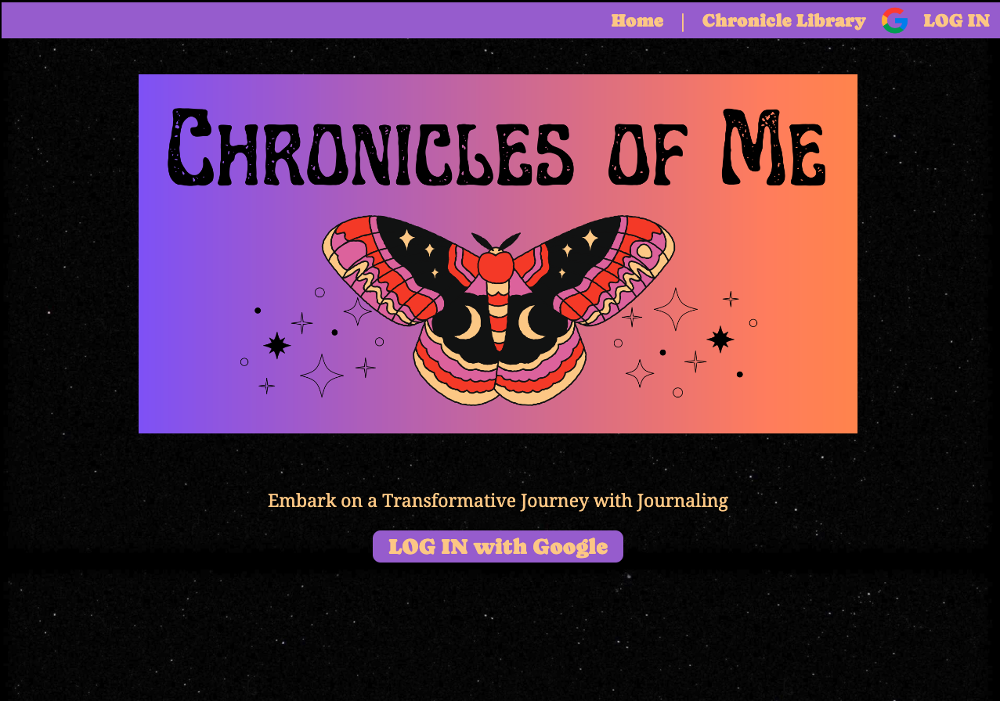
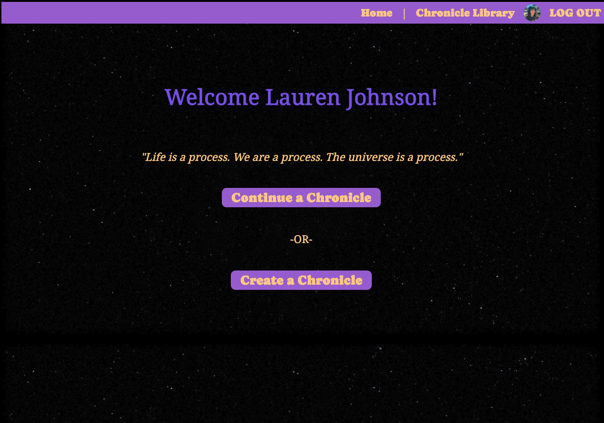
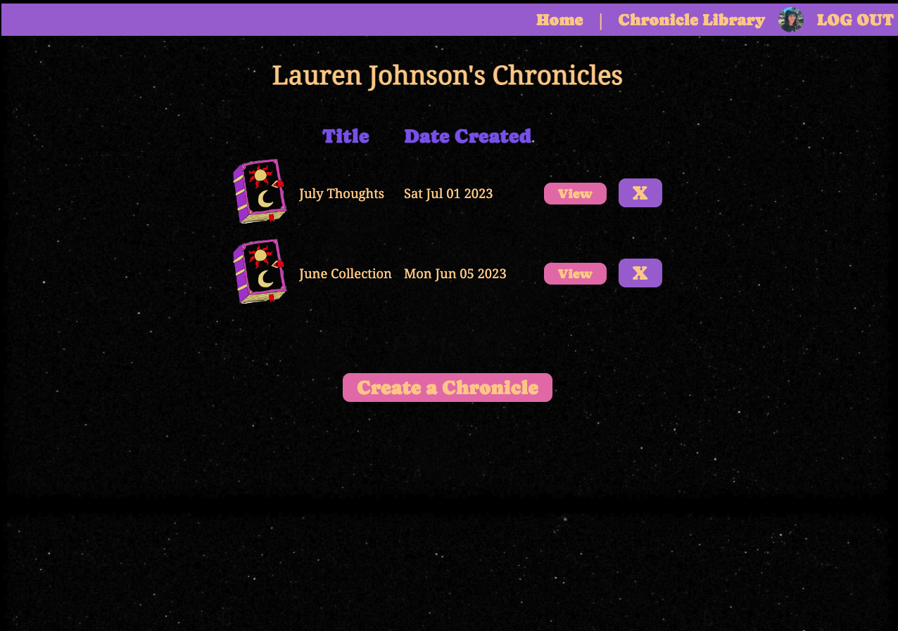
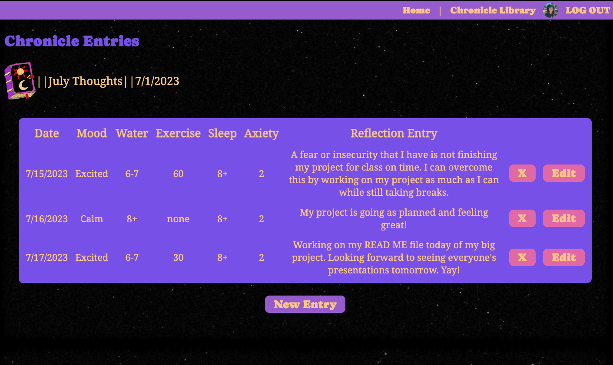

# 💫 My Chronicles 💫

## 📖 Table of Contents
- [Description](#-description)
- [Technologies Used](#-technologies-used)
- [Code Preview](#-code-preview)
- [Getting Started](#-getting-started)
- [Links](#-links)
- [Ice Box Features](#-next-steps-and-icebox-items)

## 📔 Desription:
Discover My Chronicles, a transformative journaling web app designed to help you unlock your inner thoughts, boost self-awareness, and cultivate a more mindful and fulfilling life in just 5-10 minutes a day. Capture your thoughts, reflect, and explore your emotions in a clean and intuitive interface. My Chronicles empowers you to prioritize your well-being and unlock your inner potential.

### ✨ Features:
- Convenient
- Log in with Google OAuth.
- Create and store journal entries in Chronicles for better organization.
- Calm aesthetic and intuitive display.

### Preview:
Landing Page:

Home Page:

Chronicle Library:

Chronicle Entry:


## 👩🏽‍💻 Technologies Used:


 


## 🔍 Code Preview

```ejs
<!-- This page shows the Chronicle after being created and all of that Chronicle's Entries-->

<%- include('../partials/header') %>

<!-- Displays the Chronicle that was created-->
<section id="show-page-header">
  <h1>Chronicle Entries</h1>
  <div>
    
    ||
    <div><%= chronicle.title %></div>
    ||
    <div><%= chronicle.date.toLocaleDateString() %></div>
  </div>
</section>

<!-- Displays entries -->
<div id="show-content">
  <section id="entry-table">
    <% if (chronicle.entries.length) { %>
      <table>
        <thead>
          <tr>
            <th>Date</th>
            <th>Mood</th>
            <th>Water</th>
            <th>Exercise</th>
            <th>Sleep</th>
            <th>Axiety</th>
            <th>Reflection Entry</th>
          </tr>
        </thead>
        <tbody>
          <% chronicle.entries.forEach(function(e) { %>
            <tr>
              <td><%= e.createdAt.toLocaleDateString() %></td>
              <td><%= e.mood %></td>
              <td><%= e.water %></td>
              <td><%= e.exercise %></td>
              <td><%= e.sleep %></td>
              <td><%= e.anxiety %></td>
              <td><%= e.journal %></td>
              <td>
                <form action="/entries/<%= e.id %>?_method=DELETE" method="POST">
                  <button type="submit">X</button>
                </form>
              </td>
              <td>
                <form action="/chronicles/<%= chronicle._id %>/entries/<%= e._id %>/edit" method="GET">
                  <button type="submit">Edit</button>
                </form>
              </td>
            </tr>
          <% }); %>
        </tbody>
      </table>
    <% } else { %>
      <h5>No Entries Yet</h5>
    <% } %>
  </section>

<!-- Displays the form to create a new entry in a Chronicle-->
<br>
<button id="toggleButton">New Entry</button>
<br>
<section id="hidden-form">
  <section id="new-entries-form">
    <h2>New Entry</h2>
    <form method="POST" action="/chronicles/<%= chronicle._id %>/entries">

      <label>My Mood:</label>
      <select name="mood" class="drop-box">
        <option value="Happy">Happy</option>
        <option value="Sad">Sad</option>
        <option value="Excited">Excited</option>
        <option value="Content">Content</option>
        <option value="Angry">Angry</option>
        <option value="Nervous">Nervous</option>
        <option value="Calm">Calm</option>
        <option value="Overwhelmed">Overwhelmed</option>
        <option value="Other">Other</option>
      </select>
      <br>

      <label>Water Intake:</label>
      <select name="water" class="drop-box">
        <option value="0-1">0-1 8oz glasses</option>
        <option value="2-3">2-3 8oz glasses</option>
        <option value="4-5">4-5 8oz glasses</option>
        <option value="6-7">6-7 8oz glasses</option>
        <option value="8+">8+ 8oz glasses</option>
      </select>
      <br>

      <label>Daily Exercise:</label>
      <select name="exercise" class="drop-box">
        <option value="none">None</option>
        <option value="30">30 Min</option>
        <option value="60">60 Min</option>
        <option value="90">90 Min</option>
        <option value="120+">120+ Min</option>
      </select>
      <br>

      <label>Hours of Sleep:</label>
      <select name="sleep" class="drop-box">
        <option value="0-3">0-3 Hours</option>
        <option value="3-6">3-6 Hours</option>
        <option value="6-8">6-8 Hours</option>
        <option value="8+">8+ Hours</option>
      </select>
      <br>

      <label>Anxiety Level:</label>
      <select name="anxiety" class="drop-box">
        <option value="5">5 - Extremely Anxious</option>
        <option value="4">4 - Very Anxious</option>
        <option value="3">3 - Anxious</option>
        <option value="2">2 - Very Little Anxious</option>
        <option value="1">1 - No Anxiety</option>
      </select>
      <br><br>

      <label>Daily Writing Prompt:</label>
      <p><%= randomPrompt %></p>
      <textarea name="journal" id="text-box"></textarea>
      <br><br>
      <input type="submit" value="Add Entry">
    </form>
  </section>
</section>
<br>
</div>

<!-- Javascript to hide and show entry form-->
<script>
  const toggleButton = document.getElementById('toggleButton');
  const hiddenSection = document.getElementById('hidden-form');

  toggleButton.addEventListener('click', () => {
    if (hiddenSection.style.display === 'none'|| hiddenSection.style.display === '') {
      hiddenSection.style.display = 'block';
    } else {
      hiddenSection.style.display = 'none';
    }
  });
</script>

<%- include('../partials/footer') %>
```

## 💫 Getting Started:
- [Link to My Chronicles](https://my-chronicles-60a6d00a70e1.herokuapp.com/)
Note: "My Chronicles" is currently having issues with Google Chrome. If problems persist, try a different browser.

## 🔗 Links

- [Link to Wire Frame](https://whimsical.com/project-2-wireframe-KioBaVzb6Qc1whHUmDJUzq)
- [Link to ERD](https://lucid.app/lucidchart/94662975-752b-4124-aae3-b044ad34c4d5/edit?beaconFlowId=0EB7DF3AE3A3057C&invitationId=inv_d9481bd1-2214-4058-a399-460e88ec7d48&page=0_0#)
- [Link to Inspirational Quote API](https://forum.freecodecamp.org/t/free-api-inspirational-quotes-json-with-code-examples/311373)

## 🧊 Next Steps and Icebox Items:

1. Create an edit profile feature.
2. Add abilty for user to add their zodiac sign to recieve their daily horoscope through paid API.
